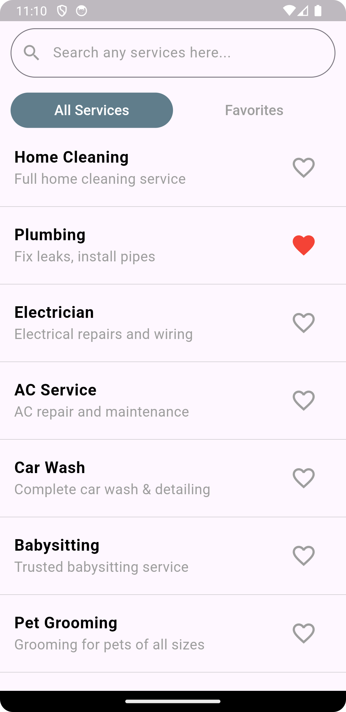
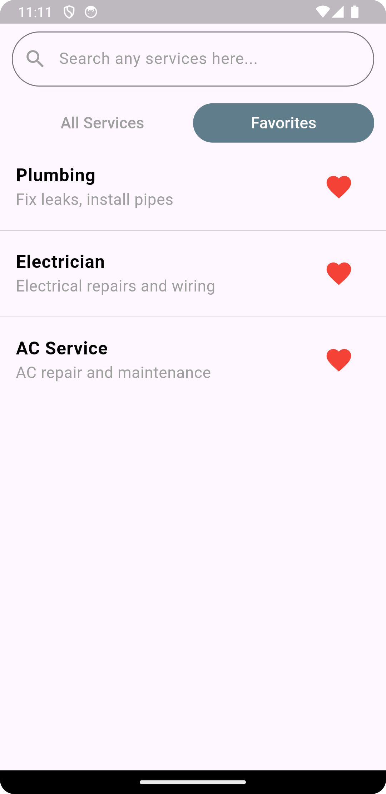
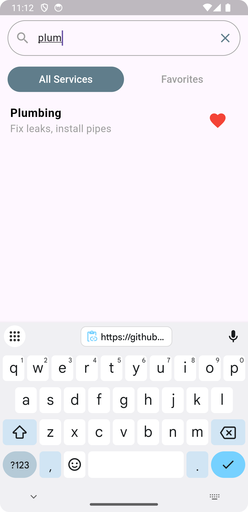

# Favorite Services (Offline Mock API)

Feature: Favorite Services screen (All Services / Favorites)
- Loads services from `assets/services.json` (mock API).
- Pagination & lazy loading (10 items per page).
- Favorite/unfavorite persisted with Hive.
- BLoC pattern for state management.
- Search support (with pagination).

## 🖼 Screenshots

| Expense(Category Wise) | Expense(Hourly) | Add Expense | Expense Report |
|------------------------|-----------------|-------------|----------------|
<table>
  <tr>
    <td></td>
    <td></td>
    <td></td>
  </tr>
</table>

---

## Run
1. flutter pub get
2. flutter run

## Notes
- `assets/services.json` contains 50 sample services.
- Hive stores favorite IDs in a local box named `favorites`.

## Tests
- Unit/widget tests: `flutter test`
- Integration tests: `flutter test integration_test`

## What to extend
- Add more widget tests & integration tests (persistence across restart).
- Replace MockApi with a real remote API by swapping `MockApi` for a network `ApiService`.
